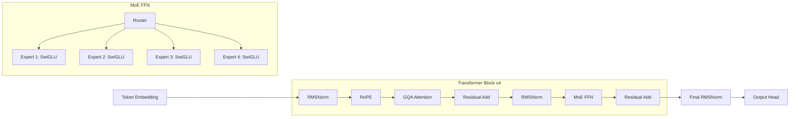

<h1 align="center">
  IRONWILL
</h1>

<p align="center">
  <strong>A mathematical language model built to reason through hard problems.</strong>
</p>

<p align="center">
  <a href="https://kshitijxfrl.github.io/irwWEB/">Project Website</a>
</p>

IRONWILL is an attempt to build a mathematically capable language model from the ground up. The long-term vision is a model that can help with deep mathematical reasoning, research, and eventually expand toward scientific work that helps unlock harder questions about the universe.

This repository contains **IRONWILL_V1**, the first proof-of-concept model and training system.

## IRONWILL_V1

Current model:

- **Parameters:** ~177M
- **Context length:** 512 tokens
- **Vocabulary:** 71,658 tokens
- **Training:** 10,000 steps
- **Micro batch:** 1
- **Learning rate:** 0.0003
- **Training data:** Olympian_01 math dataset

Architecture:



Dataset:

- `dataset/train.jsonl`
- `dataset/validation.jsonl`
- `dataset/test.jsonl`
- `dataset/manual_merges.txt`

The dataset is split into math categories such as arithmetic, algebra, calculus, and trigonometry. Each category uses templates with step-by-step reasoning variations, then expands those templates into a large synthetic dataset.

## Folder Layout

Expected folders:

```text
dataset/
  train.jsonl
  validation.jsonl
  test.jsonl
  manual_merges.txt

vocab/
  vocab.json

binFiles/
  train_tokens.bin
  val_tokens.bin
  test_tokens.bin

model_checkpoints/
  checkpoint_latest.bin
  checkpoint_latest.optim
```

If `vocab/vocab.json` or the `.bin` files are missing, the program creates them from the dataset files.

For inference, place the downloaded weights here:

```text
model_checkpoints/checkpoint_latest.bin
model_checkpoints/checkpoint_latest.optim
vocab/vocab.json
```

## Compile

```bash
nvcc -std=c++17 -Iinclude -Iinclude/nlohmann \
  main.cpp attention.cpp embedding.cpp filehandler.cpp linear.cpp llmAssembly.cpp llmInference.cpp \
  moe.cpp optimizer.cpp residualADD.cpp rmsNorm.cpp rope.cpp SwiGLU.cpp tensor.cpp tokenUtility.cpp \
  cuda/adamW.cu cuda/crossEntropyLoss.cu cuda/embedding_lookup.cu cuda/gqa.cu cuda/linearmul.cu \
  cuda/matmul2d.cu cuda/moek.cu cuda/rootmeansquare_norm.cu cuda/ropek.cu cuda/silu.cu \
  cuda/tesnorKernal.cu \
  -o ironwillV1
```

## Train

```bash
./ironwillV1
```

Training resumes from the latest numbered checkpoint in `model_checkpoints/` when available.

## Inference

```bash
./ironwillV1 prompt $'[CALC]\nQuestion:\nDerivative of: sin x\n\nAnswer:'
```

Example output from IRONWILL_V1:

```text
[CALC] Question : Derivative of : sin x Answer : cos x
```

## Weights

Download the IRONWILL_V1 10K checkpoint package from the project release page:

```text
https://github.com/KshitijxFrl/irwWEB/releases/tag/ironwill-v1-10k
```

Put the files in:

```text
model_checkpoints/
vocab/
```

## Threminent

IRONWILL is built on the first iteration of **Threminent**, a lightweight C++/CUDA GPU framework:

```text
https://github.com/KshitijxFrl/Threminent
```
